# The full app, every surface (HTML, 2026-09)

Every screen, sheet, popover, toast and state of VOTReader, redrawn in the Vesper (dark) and Vellum (light)
system: **214 renders across 24 areas**, each in both themes unless it is dark by design. The pass
worked from [INVENTORY.md](INVENTORY.md), a sweep of the source that lists 318 surfaces with their real copy and
source paths. Each area was drawn from its source files, and the text is verbatim from the corpus. While reading the
source, the pass also found fifty problems in the running app; they are listed in [FINDINGS.md](FINDINGS.md).

- **Browse it large, dark and light side by side, with comments:** [VOTReader Atlas](https://claude.ai/artifact/DnJDEpcqD2hExSDcfy3X6p) (private artifact).
- **Sources:** `html/screens/<name>.html` on the kit in `html/kit/`. `html/KIT.md` and `html/FULLAPP.md` are the briefs
  every screen was drawn to.
- **Render one:** serve the repo root on loopback (`python3 -m http.server 8095 --bind 127.0.0.1`), then run
  `node render.mjs <name>` from `html/`. It writes `html/renders/<name>-dark.png` and `-light.png`. You need Playwright
  and Chromium; `render.mjs` imports a global Playwright, so adjust that path to your install. The fonts and the
  Scripture Web data come from the app's own files, so nothing is duplicated.

## The system in one screen of rules

- **Vesper:** true black, filled charcoal surfaces, warm ivory text, and one antique-gold accent. **Vellum:** warm
  paper, ink and one oxblood accent. Both themes render from the same HTML through tokens.
- **Type:** EB Garamond for titles and reading, Atkinson Hyperlegible for every control. Digits come from the bundled
  Lexend, because Atkinson's slashed zero reads as a typo in times and counts.
- **Ten mark colours**, as in the app. The kit's calm six gain red, teal, brown and gray, chosen so that every pair of
  washes stays at least ΔE 6.5 apart in both themes and text on any wash stays at 9.5:1 or better.
- **Warn and danger:** `--warn` (amber) marks a recoverable clear; `--danger` (a muted rose) marks anything that
  deletes or overwrites the reader's own data. Both are tinted, never solid, and their labels lead with the verb.
- **Immersive views stay dark in both themes**, as the app does. The Scripture Web's canvas is black by construction,
  and the Garden's photographs read truest on black.
- **Listen lives in the hero** as the Listen pill. Once the hero scrolls away, it may collapse into the top bar as a
  headphones button.
- **One primary control per top bar:** Bookmark on reading pages, the Reading Position Marker on browse pages.
- **Healthy by default:** no streak pressure (the proposal drops the two streak cells and categories), no invented
  features, and a calm, consistent confirm language (see `annotation` › Confirms).

## Concepts

Two boards go beyond what the app does today and are labelled as concepts: a home-screen widget, and a
Scripture Web layer for the 51 messianic prophecy pairs that already ship in `scripture-web-data.js` but are
never drawn.

## Every area

### Home & navigation · 6

Launch, Home, the top bar and the Surprise Me button.

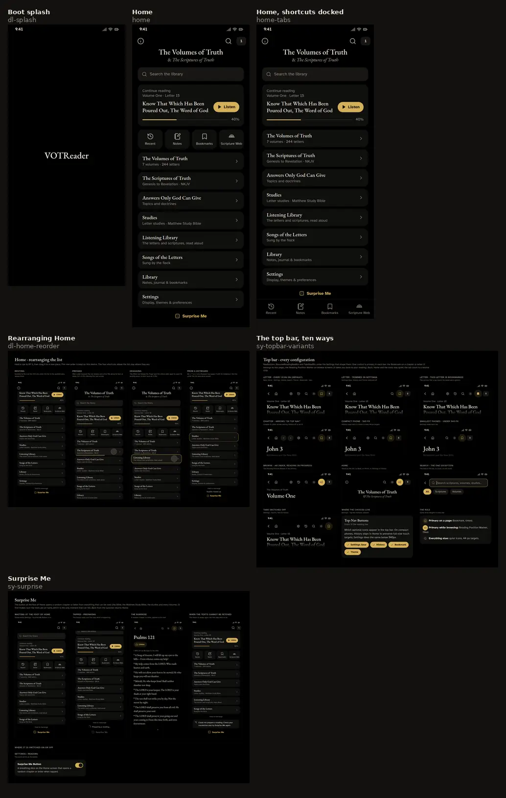

What each render shows

- **Boot splash** (`dl-splash`): Only the word VOTReader in EB Garamond, set exactly where Android's own launch icon sits so the two splashes hand over in place. No spinner.
- **Home** (`home`): Opens on where you left off. All nine destinations: eight rows plus History through Recent, About in the top bar, and Surprise Me with its dice.
- **Home, shortcuts docked** (`home-tabs`): The same Home with its shortcut row (Recent, Notes, Bookmarks, Scripture Web) docked at the bottom for the thumb.
- **Rearranging Home** (`dl-home-reorder`): Hold to rearrange, a pressed row, a row lifted over its landing place, and keyboard reordering with its live status line.
- **The top bar, ten ways** (`sy-topbar-variants`): Letter, trimmed, bookmarked, arrows in the bar, 360 px, under 340 px, browse, Home, Search and tabs off: one primary control per page.
- **Surprise Me** (`sy-surprise`): The button at the foot of Home, Preparing a reading…, the result (Psalm 121, verbatim), the failure line and its Settings row.

### Reading: the letters · 15

The Volumes, their letter indexes and the letter page in every variant.

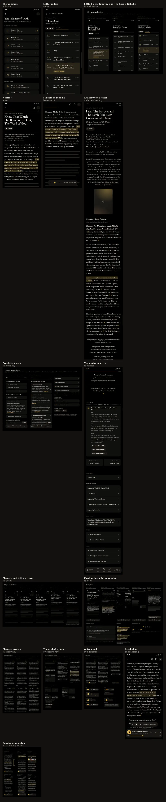

What each render shows

- **The Volumes** (`volumes`)
- **Letter index** (`index`): Scrolled to where you are.
- **Little Flock, Timothy and The Lord's Rebuke** (`bs-collections`): The three letter-collection indexes, with real titles.
- **A letter** (`letter`): Letter 15, verbatim: the shared top bar (back, bookmark, tabs), the Listen pill in the hero, and footnote bubbles where the letter has them.
- **Fullscreen reading** (`letter-focus`): Double-tap fullscreen: the status bar hides, the top bar stays, and the Auto-Scroll control floats.
- **Anatomy of a letter** (`rd-letter-anatomy`): Every meta and body kind the letter view renders, assembled from real passages of four letters and two studies.
- **Prophecy cards** (`rd-prophecy`): One card open and all open, the four card tags, and Collapse / Expand all.
- **The end of a letter** (`rd-related`): Closing, footnotes, Previous and Next, then Also Read, Related Topics, Bible Study, Audio and Videos.
- **Chapter and letter arrows** (`rd-arrows`): The five layouts on the same page, with their labels from the app.
- **Moving through the reading** (`rd-flows`): The back pill across two hops, the landing flash, the swipe peek, a swipe across into Words To Live By, fullscreen and the journal chip.
- **Chapter arrows** (`sy-sticky-nav`): The five arrow layouts on John 3, and Genesis 1 with Previous disabled.
- **The end of a page** (`sy-bottom-nav`): The end of a letter and of a book, a footnote landing with its Back band, and the reading chain crossing from Revelation into Volume One.
- **Auto-scroll** (`sy-autoscroll`): The pill running, dimmed, and counting down to the next chapter with Cancel; seven pill states at full size.
- **Read-along** (`au-readalong`): Letter 15 mid-read-along: the clause timed at 2:45 is washed gold, with the auto-scroll pill and the bar.
- **Read-along: states** (`au-readalong-states`): Follow the Voice's band, the lead-in on the title, Listen from here, scrolling by hand, auto-scroll, and John 3 with verse 3 washed.

### Words To Live By, The Blessed & Holy Days · 7

The Format B collections: inline citations that open the verse.

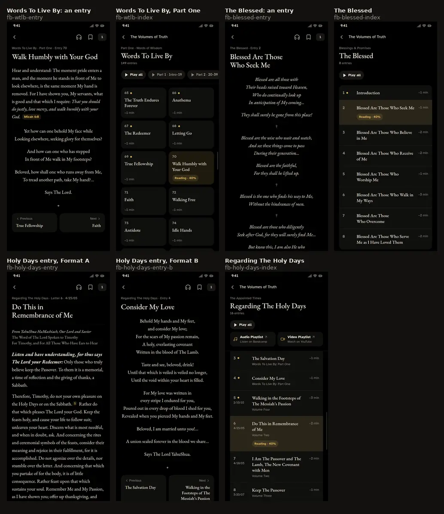

What each render shows

- **Words To Live By: an entry** (`fb-wtlb-entry`): Walk Humbly with Your God: prose, the Micah 6:8 cite chip, centred stanzas and the Previous and Next cards.
- **Words To Live By, Part One** (`fb-wtlb-index`): The two-column index scrolled to entry 70, with Play all and the part chips.
- **The Blessed: an entry** (`fb-blessed-entry`): Blessed Are Those Who Seek Me, verse set apart by the text's own † marks.
- **The Blessed** (`fb-blessed-index`): All eight entries with Play all.
- **Holy Days entry, Format A** (`fb-holy-days-entry`): Do This in Remembrance of Me: a letter-style entry with numbered footnote bubbles.
- **Holy Days entry, Format B** (`fb-holy-days-entry-b`): Consider My Love: verse with inline citations and no dedication.
- **Regarding The Holy Days** (`fb-holy-days-index`): Play all, the audio and video playlists, and each entry with where it was gathered from.

### Reading: the Bible · 10

Scripture browsing, the chapter reader, translations and the Restored Name editions.

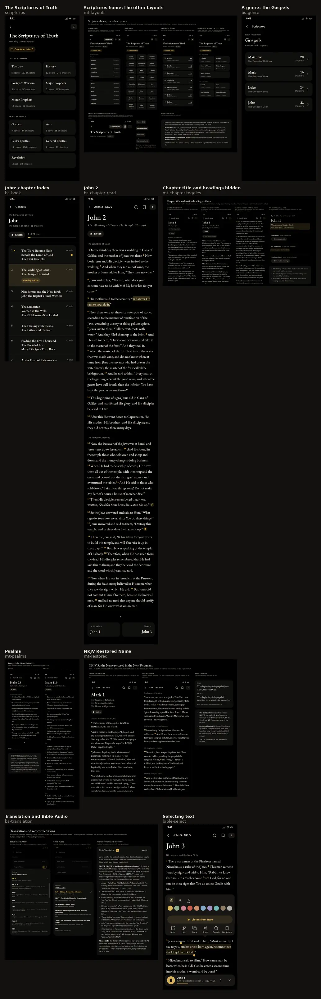

What each render shows

- **The Scriptures of Truth** (`scriptures`)
- **Scriptures home: the other layouts** (`mt-layouts`): Compact List, Book Grid, Canonical Scroll, and Genre Grid before its counts load, with the layout button and its caption.
- **A genre: the Gospels** (`bs-genre`): Each book with its chapter count and its own subtitle from the data.
- **John: chapter index** (`bs-book`): Real chapter titles and minutes, read dots, a bookmark, a chapter in progress, Listen and 1 of 21 read.
- **John 2** (`bs-chapter-read`): The whole chapter in NKJV: section headings, verse numbers, a highlight, the reader's link and bookmark marks, Previous and Next.
- **Chapter title and headings hidden** (`mt-chapter-toggles`): John 3 with its title hidden and with its headings hidden, each with its + Show control.
- **Psalms** (`mt-psalms`): Psalm 23 in the poetry layout, and Psalm 119 with its Aleph, Beth and Gimel stanza headings.
- **NKJV Restored Name** (`mt-restored`): Mark 1 with the restored Name from the overlay, beside plain NKJV. The app sets it as plain, unmarked text.
- **Translation and Bible Audio** (`bs-translation`): All ten translations including NKJV-R and KJV-R, the audio editions with Off, and the Restored Name note.
- **Selecting text** (`bible-select`): The annotation toolbar with six calm colours.

### Footnotes & cross-references · 5

Numbered bubbles, the verse sheet, the end-of-letter list and the wide-screen rail.

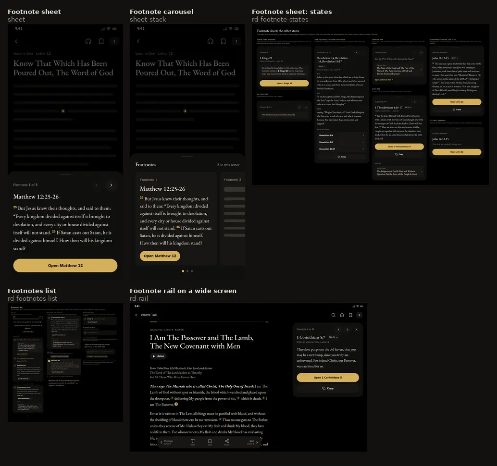

What each render shows

- **Footnote sheet** (`sheet`)
- **Footnote carousel** (`sheet-stack`)
- **Footnote sheet: states** (`rd-footnote-states`): Missing verse text, no content, a compound footnote split into three buttons, Open in App, Also see, and the inline Scripture Reference sheet.
- **Footnotes list** (`rd-footnotes-list`): Volume One, Letter 11 in full: Read more, jump back, the missing-text lines, and an echo pill.
- **Footnote rail on a wide screen** (`rd-rail`): The letter on the left and the footnote docked on the right with no dimming. Today's app docks it only at 1640 px and wider.

### Highlights, notes & marks · 12

The selection toolbar, the ten colours, notes and their sub-sheets.

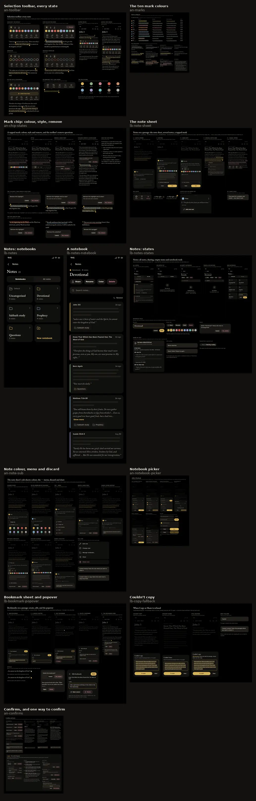

What each render shows

- **Selection toolbar, every state** (`an-toolbar`): Highlight, over an existing mark, Underline, Squiggle, Listen from here, no markable text, flipped below, and across two verses.
- **The ten mark colours** (`an-marks`): All ten in all three styles on real verses, in both themes, and every note case. Every wash pair is at least dE 6.5 apart.
- **Mark chip: colour, style, remove** (`an-chip-states`): The chip's colour picker, style picker and remove question, and the toolbar's three remove wordings.
- **The note sheet** (`lb-note-sheet`): A note open, editing, a new note, 3 notes here, the annotation chip at rest, the note icons, and the sheets' crash toast.
- **Notes: notebooks** (`lb-notes`): Uncategorized plus four colour-tagged notebooks, and New notebook. Names are examples.
- **A notebook** (`lb-notes-notebook`): Share, Rename, Color and Delete, search, sort and five notes. Note text is placeholder bars.
- **Notes: states** (`lb-notes-states`): All notes and Share as text, No notes yet, an empty notebook, no matches, the new-notebook form, rename, colour, delete, the exported file, the export toasts and the back pill.
- **Note colour, menu and discard** (`an-note-sub`): Change color with No color, the ⋯ menu, Delete this note?, the share toasts, and both discard questions.
- **Notebook picker** (`an-notebook-picker`): Add to Notebook, Manage Notebooks, creating one, empty, delete and discard.
- **Bookmark sheet and popover** (`lb-bookmark-popover`): A new bookmark from a selection, a whole-chapter bookmark, editing (Save waits for a change), delete, and the popover for two bookmarks in one place.
- **Couldn’t copy** (`lb-copy-fallback`): Couldn’t copy, Couldn’t share, Still blocked, and the Copied and Copied instead toasts.
- **Confirms, and one way to confirm** (`an-confirms`): The ConfirmStrip variants and toasts, and a proposal: one wording and one muted rose for every delete, where more weight means more steps, not new words.

### Search · 16

Search in every state, from the first keystroke to the rarest error.

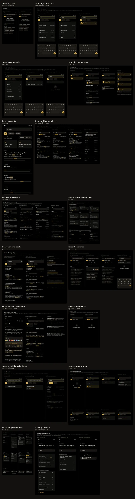

What each render shows

- **Search: ready** (`sy-search-idle`): The field focused, All / Scriptures / Volumes, Search everything, recent searches and the 11 quick picks; and a first visit with no Recent row.
- **Search: as you type** (`sy-search-typing`): Suggestions for 'g' and 'ma', and 'john 3:16' going straight to its chapter. Suggestions and counts are real output from the app's search engine.
- **Search commands** (`sx-slash`): Typing / lists eight of the nine commands; /r shows the ninth. /help has no handler in the app.
- **Straight to a passage** (`sx-direct`): john 3 alone, revelation above its text hits, the Beatitudes quick pick, and all four card kinds.
- **Search results** (`search`): faith: Found 400+ matches across 18 sections, All / Scriptures / Volumes, Relevance or Book order.
- **Search: filters and sort** (`sy-search-filters`): 'faith' four ways: Scriptures by best match and in book order, and Volumes open and collapsed, with real counts.
- **Results in sections** (`sx-groups`): mercy capped at 400+: Best Matches, five sections open and the rest closed, in Book order.
- **Result cards, every kind** (`sx-kinds`): One card per kind badge with the translation and heading badges, location and marked snippet. Five of these kinds no longer occur in today's index.
- **Search in one book** (`sx-scope`): born again opened from John 3: offered, then scoped (70 matches in 1 section), with chip samples.
- **Recent searches** (`sx-recent`): Twelve recent searches, the Yes, remove confirm, and what /clear history does.
- **Search from a selection** (`sx-from-selection`): The real six-action toolbar with Search pressed, then Search opened on the selected words with Search in John offered.
- **Search: no results** (`sy-search-noresults`): No results in All and in Scriptures. The app offers no next step; the caption notes All would find 22 matches for the second.
- **Search: building the index** (`sy-search-loading`): Building search index… starting and at 18,000 of 32,025, then Searching… over faded results.
- **Search: rare states** (`sx-states`): Did you mean Psalms?, a reference typed while the index builds, Search couldn't start, a failed build, Searching…, and the build bar.
- **Searching inside lists** (`sx-in-list`): History, Links, Notes, Bookmarks, Marks, Journal, Saved recordings and Songs mid-search, each with its no-match wording.
- **Asking Answers** (`sx-answers-ask`): death (full results), tithe (topics that mention it) and nicodemus (the empty state), verbatim from answers.js.

### Links · 17

Linking any passage to any other, down to the deepest picker state.

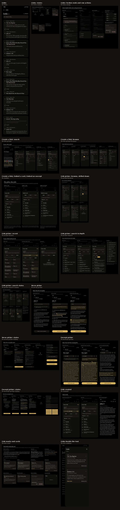

What each render shows

- **Links** (`lb-links`): Six link cards, each source and target joined by a thread: passages cut at two lines, a whole-letter target and a journal source.
- **Links: states** (`lb-links-states`): No matches, No links yet, the four sorts, Show more and Show less, and Remove this link?
- **Links: broken ends and row actions** (`lk-links-deep`): The broken-links callout with an (unknown) end, the row options sheet, Delete this link?, the four sorts, and the card's Remove this link?
- **Create a link: search** (`lb-link-picker`): Step by step: select text and tap Link, recent picks, search by reference, by title and in the full text, with the corpus chips.
- **Create a link: browse** (`lb-link-picker-browse`): Browse with real counts, the Bible's books, John's chapter grid, Volume Two's letters, the Recent tab, and Embed a card from the Journal.
- **Create a link, Embed a card, Embed an excerpt** (`lk-modes`): The picker's three modes side by side, each with what a pick does.
- **Link picker: browse, drilled down** (`lk-picker-browse`): The library list, the Bible's books in canonical order, John's chapters, the Matthew grid, a study, and Loading the library…
- **Link picker: recent** (`lk-picker-recent`): From ⇄ To rows, tapping either end to link at once, and No links yet.
- **Link picker: search in depth** (`lk-picker-search`): Recent picks, Titles & refs for 'repent', Full text 'born again' in Volumes, and a legend of every row badge.
- **Link picker: search states** (`lk-picker-search-states`): All seven states in the app's words, including Search the full text instead and Search every corpus instead.
- **Verse picker** (`lk-verse-picker`): John 15 while linking from Born Again: nothing selected, part of verse 2 selected, and the word filter with verse 5 grabbed by its number.
- **Verse picker: states** (`lk-verse-picker-states`): No verse contains the word, journal insert mode, the Matthew Study Bible, chapter not found, and every breadcrumb and footer wording.
- **Excerpt picker** (`lk-excerpt-picker`): Born Again (Volume Three) linking from John 3:3: find with its hit washed, an excerpt held, and the next hit.
- **Excerpt picker: states** (`lk-excerpt-picker-states`): Whole entry and whole chapter, journal insert on Letter 15, 0 found, and letter not found.
- **Link created** (`lk-created`): Link created · Born Again with Undo, the sheet after Undo, and John 3 with its new link icon.
- **Link marks and cards** (`lb-link-card`): Marks in the text (gold where you linked from, dim where something links to you), the card at rest, pressed, long and expanded, the From: fallback, and the empty drawer.
- **Links beside the text** (`lb-link-sidebar`): John 3 with its link marks and the Links drawer holding two cards.

### Library: notes, bookmarks & marks · 5

The Personal Study hub and its collections.

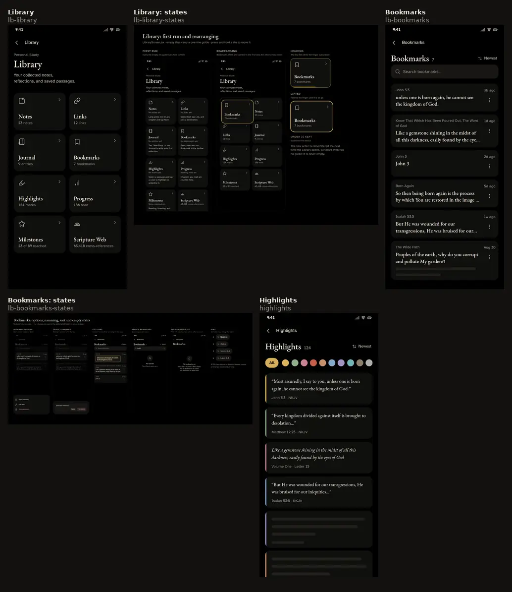

What each render shows

- **Library** (`lb-library`): The Personal Study hub with all eight tiles filled: notes, links, journal, bookmarks, highlights, progress, milestones and the Scripture Web.
- **Library: states** (`lb-library-states`): First-run guide text on every tile, and a tile being pressed, lifted and dragged to a new place.
- **Bookmarks** (`lb-bookmarks`): The bookmark list with sort and search.
- **Bookmarks: states** (`lb-bookmarks-states`): The options sheet, the delete confirm, renaming a label in place, no matches, No bookmarks yet and the four sorts.
- **Highlights** (`highlights`)

### Journal · 15

The private journal: entries, blocks, media and voice memos.

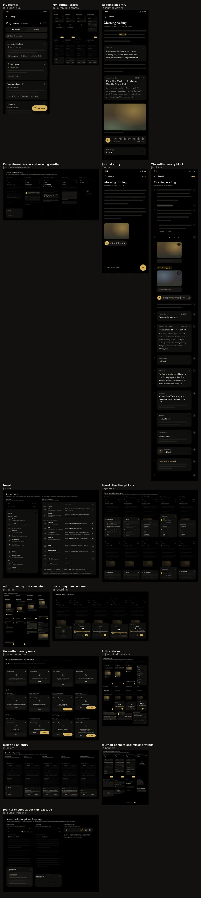

What each render shows

- **My Journal** (`jp-journal-hub`): Entries with date, pin, preview and attachment chips; All entries and Pinned, search, sort and New entry. The reader's writing is placeholder bars.
- **My Journal: states** (`jp-journal-hub-states`): Empty, no pinned entries, no matches, the unclaimed-recordings banner, the entry menu and the three-step delete.
- **Reading an entry** (`jp-journal-viewer`): A pinned entry with an inline John 3:3 chip, the verse block, a Letter 15 excerpt card, a photo, a voice memo and a chapter card.
- **Entry viewer: menu and missing media** (`jp-journal-viewer-menu`): The ⋮ menu, a linked entry reached with its back pill, Image missing, Recording missing and Entry not found.
- **Journal entry** (`journal`)
- **The editor, every block** (`jn-blocks`): Text, heading, quote, divider, images, a voice memo and every card kind (letter, excerpt, chapter, verse, bookmark, note, entry, notebook), each with its grip and delete.
- **Insert** (`jn-insert`): The Insert sheet's four groups and ten rows, beside a table of what each opens.
- **Insert: the five pickers** (`jn-pickers`): Pick a bookmark, a note, a journal entry, part of an entry, or a notebook: each filled, then empty.
- **Editor: moving and removing** (`jn-reorder`): A block mid-drag, Delete this block?, Remove this voice memo?, Block deleted with Undo, Could not save that image, and a new empty entry.
- **Recording a voice memo** (`jn-recording`): Asking for the microphone, recording with the live waveform, paused, the discard confirm, and review.
- **Recording: every error** (`jn-recording-errors`): All twelve, grouped by cause (permission, device, storage, nothing captured), each with the buttons the app really offers.
- **Editor states** (`jp-journal-editor-states`): Reorder, the delete-block strip, the undo toast, the Insert sheet, a photo attached, recording, review and the microphone errors.
- **Deleting an entry** (`jn-delete`): Entry options, then the three steps with the note of what else goes with it, and step one for an empty entry.
- **Journal: banners and missing things** (`jn-banners`): Unclaimed recordings, Entry not found, missing media, and the milestone toast.
- **Journal entries about this passage** (`lb-journal-inbound`): The inbound sheet with two entries, its empty line, and the journal mark with its count. Nothing in the app opens this sheet yet.

### Progress, milestones & history · 5

A calm record of reading, with no streak pressure.

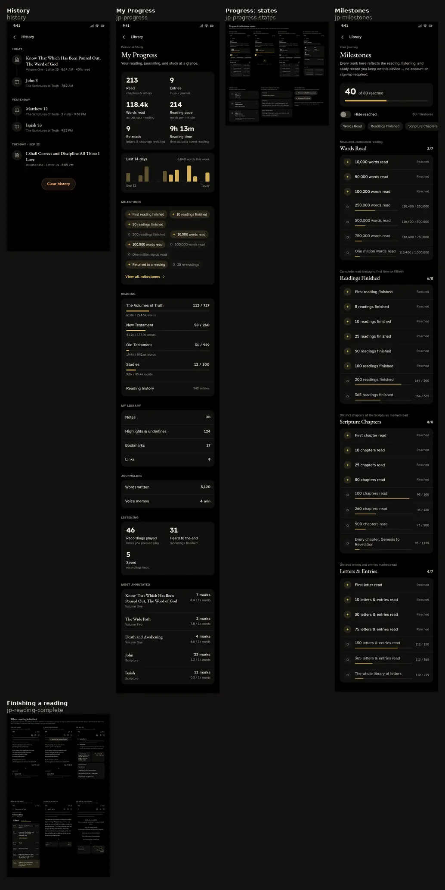

What each render shows

- **History** (`history`): A calm trail of what you read.
- **My Progress** (`jp-progress`): A calm record: stats, the last 14 days, milestones, reading per collection, library, journaling, listening, most annotated. Proposal: the two streak cells are left out.
- **Progress: states** (`jp-progress-states`): Hide reached, all reached, a new reader, the loading, Mark-as-Read-off and nothing-marked notes, and the milestone pill.
- **Milestones** (`jp-milestones`): N of M reached, Hide reached, jump chips and progress rows. Proposal: the two streak categories are left out, so it counts 80 where the app counts 89.
- **Finishing a reading** (`jp-reading-complete`): The end of a letter, a milestone crossed, on to Volume Two, the index afterwards, the end of John 3, and Holy Days leading on to the Garden.

### Tabs · 4

Reading places side by side.

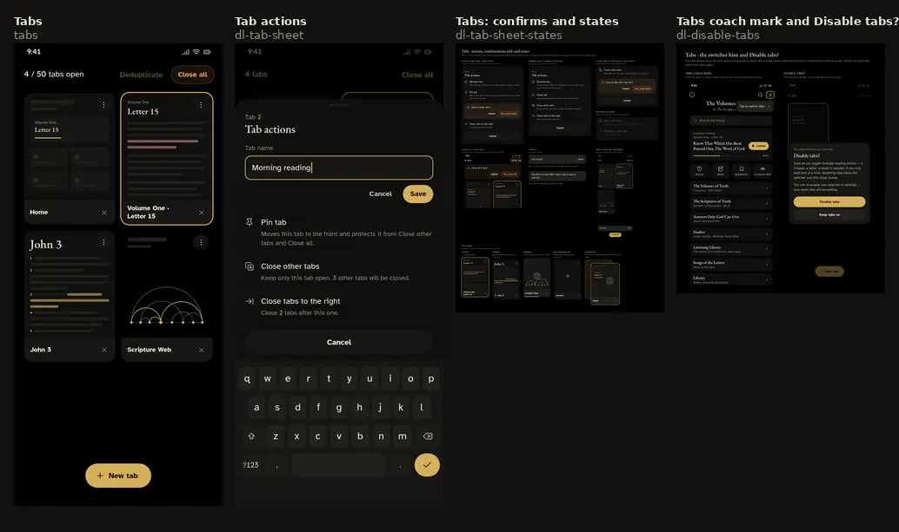

What each render shows

- **Tabs** (`tabs`): Every card with its ⋮ Tab actions and ×, 4 / 50 tabs open, Deduplicate and Close all.
- **Tab actions** (`dl-tab-sheet`): The tab action sheet over the Tabs overview, with the rename field open.
- **Tabs: confirms and states** (`dl-tab-sheet-states`): Close others, close to the right and close all, a pinned tab with its own name, the tab toasts with Undo, and five tab card states.
- **Tabs coach mark and Disable tabs?** (`dl-disable-tabs`): Tap to switch tabs on Home, and the prompt that appears after closing the last tab again and again.

### Listening · 19

The Listening Library, the listening desk, downloads and read-along.

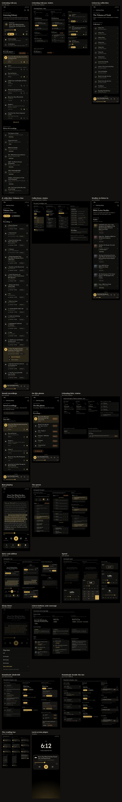

What each render shows

- **Listening Library** (`au-library`): The shelf, full scroll: now playing, Saved and On this phone, Recently played, and Browse with the three sources and five Bible editions.
- **Listening Library: states** (`au-library-states`): First run, Resume last, connecting, paused, and Recently played folded away.
- **Listen by collection** (`au-volumes`): The 14 collections in reading order. Hidden Manna is absent, as intended.
- **A collection: Volume One** (`au-collection`): Letter 15 playing with its two voices open, the download lines, Play all and Download all (Android).
- **Collections: states** (`au-collection-states`): A Bible edition by book, a part-recorded study, no signal, compilations downloading or failed, and both empty messages.
- **Studies to listen to** (`au-studies`): The seven studies: 2 with audio, 5 to read, one playing chapter 5.
- **Saved recordings** (`au-saved`): The recordings the reader chose to keep, with Find.
- **On this phone** (`au-offline`): Downloaded recordings with Remove and Remove all (Android).
- **Listening lists: states** (`au-lists-states`): No match, nothing saved, nothing on the phone, loading, no recordings yet, and a single download.
- **Now playing** (`player`): The spoken sentence washed in gold.
- **The queue** (`ad-queue`): 5 of 19 with heard rows dimmed, Playing now, reorder and remove, Clear upcoming, a 150-chapter queue paged, Resuming…, and empty.
- **Voice and edition** (`ad-voice`): The voice card and its note, the four-edition Audio Bible card on John 3, both switch confirms, and a one-voice letter.
- **Speed** (`ad-speed`): 1.37× with − slider +, six presets, typing 1.6, and + disabled at 3×.
- **Sleep timer** (`player-sleep`)
- **Listen buttons and coverage** (`ad-coverage`): Listen, Play all and the section chips, and the three coverage badges with their exact sentences.
- **Downloads (Android)** (`ad-downloads`): Every per-row and per-collection download state, the download confirm with its not-enough-room variant, and Remove all.
- **Downloads beside the bar** (`au-mini-offline`): The six download lines under a recording, the states beside Play all, and the offline-library strip messages.
- **The reading bar** (`au-mini-states`): Playing, paused, buffering, couldn't load, no connection, a single recording, crossing volumes and a compilation; the pull-tab; the audio toasts.
- **Lock-screen player** (`media`)

### Songs of the Letters · 6

Songs made by the flock from the words of the letters.

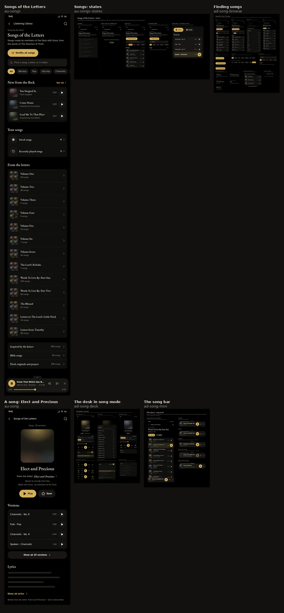

What each render shows

- **Songs of the Letters** (`au-songs`): Shuffle, Find, style chips, New from the flock, Your songs, the letter tiles and shelves. Real titles from the public catalog; covers are abstract.
- **Songs: states** (`au-songs-states`): Loading, the first-time connection message, the Worship filter, no match, and the song page playing.
- **Finding songs** (`ad-song-browse`): Find results, the Worship filter, More styles with real counts, the shuffle buttons, the five empty lists, More songs from this letter, and a song no longer shared.
- **A song: Elect and Precious** (`au-song`): 15 versions, the letter it comes from, Versions, and a four-line lyrics preview as placeholder bars.
- **The desk in song mode** (`ad-song-desk`): Elect And Precious: the cover, Open the letter, Versions and the Versions sheet, the transport, and timed lyrics with Follow along.
- **The song bar** (`ad-song-mini`): Playing, paused, loading, Not on this phone, and a single song with no Next.

### Studies & the Matthew Study Bible · 11

Bible/Letter Studies, the Matthew Study Bible and its study-notes modes.

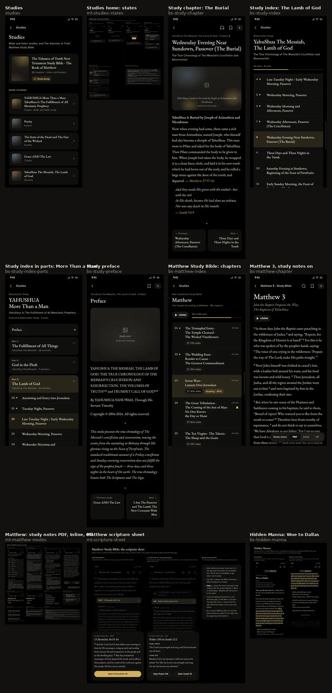

What each render shows

- **Studies** (`studies`)
- **Studies home: states** (`mt-studies-states`): Loading, coming soon and both load errors, and the card metas. Most of these can never appear in today's app.
- **Study chapter: The Burial** (`bs-study-chapter`): The Lamb of God, chapter 8: its image placeholder, heading, Matthew 27:57-61 and Isaiah 53:9.
- **Study index: The Lamb of God** (`bs-study-index`): A flat list scrolled to chapter 8, in progress.
- **Study index in parts: More Than a Man** (`bs-study-index-parts`): The Preface and the parts as an accordion, Part 3 open.
- **Study preface** (`bs-study-preface`): The Lamb of God Preface under its cover placeholder.
- **Matthew Study Bible: chapters** (`bs-matthew-index`): Chapters 21–25 with the notes-weight chips, one in progress and one bookmarked.
- **Matthew 3, study notes on** (`bs-matthew-chapter`): Verses 1–10 with the floating Study notes control, PDF selected.
- **Matthew: study notes PDF, Inline, Off** (`mt-matthew-modes`): Matthew 23 in each mode, the HM note that leads to Hidden Manna, the summary toggle, Further Study and the notes chip.
- **Matthew scripture sheet** (`mt-scripture-sheet`): A single reference, and a two-passage citation with a button per passage.
- **Hidden Manna: Woe to Dallas** (`bs-hidden-manna`): Reached only from a Matthew study note: arriving with the Back to Matthew 23 breadcrumb and the quoted passage marked, and its end with no previous or next.

### Answers Only God Can Give · 6

Topics and doctrines, the Ten Commandments and the ask box.

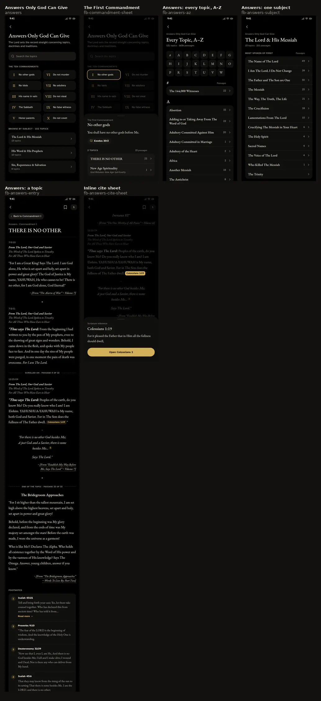

What each render shows

- **Answers Only God Can Give** (`answers`)
- **The First Commandment** (`fb-commandment-sheet`): From the tablets on Answers home: the verse, the Exodus 20:3 button and the topics that speak of it.
- **Answers: every topic, A–Z** (`fb-answers-az`): 121 topics and 1,636 passages, a letter-jump grid, then each letter's topics with passage counts.
- **Answers: one subject** (`fb-answers-subject`): The Lord & His Messiah: 13 topics, 211 passages, most spoken of first.
- **Answers: a topic** (`fb-answers-entry`): THERE IS NO OTHER, verbatim: the dedication, passages with their source lines, an inline cite chip and a footnote bubble, footnotes, related topics.
- **Inline cite sheet** (`fb-answers-cite-sheet`): Tapping (Colossians 1:19) in a Format B entry: the NKJV verse and Open Colossians 1, with the chip still lit above.

### Scripture Web · 13

63,418 cross-references drawn as threads, plus My Web, the reader's own links.

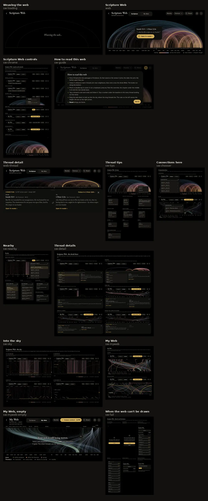

What each render shows

- **Weaving the web** (`sw-loading`): The loading state over a faint outline of the dome.
- **Scripture Web** (`web`): Essential density; Isaiah 53:5 ↔ 1 Peter 2:24 selected.
- **Scripture Web controls** (`sw-chrome`): The top bar and controls in every setup: Famous, Essential, the density menu, Nearby, My Web with Corpus context, and controls hidden.
- **How to read this web** (`sw-guide`): The six bullets and Got it. The zoom line is corrected: the on-screen + button no longer exists.
- **Thread detail** (`web-thread`): Both passages, verbatim NKJV.
- **Thread tips** (`sw-tips`): One tip in place over the web, and all ten tip variants.
- **Connections here** (`sw-chooser`): Choosing among close threads on the Scripture web and in My Web.
- **Nearby** (`sw-nearby`): The list under the lens on Isaiah 53, with its other headings and its empty line.
- **Thread details** (`sw-detail`): Bundle, Chapter, Verse, Your link, Timothy's thread, and an end that can't be opened.
- **Into the sky** (`sw-sky`): Isaiah 53 zoomed about 1,100×, from the baseline up past a chapter, a book and a testament: the height ruler and bar, count pills, far-end refs and the lit chapter.
- **My Web** (`sw-myweb`): The reader's links between the Volumes rail and the Bible rail, all 2,095 of Timothy's threads, the legend, and both rails zoomed with Reset.
- **My Web, empty** (`sw-myweb-empty`): Your web is still being woven, over Timothy's threads.
- **When the web can't be drawn** (`sw-fail`): The load error, the no-WebGL panel, the fallback list and its empty line, and one proposed design for every failure.

### A Return to The Garden · 4

209 photographs, streamed and cached.

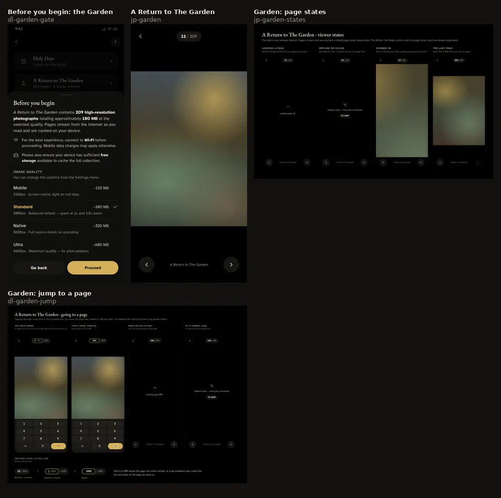

What each render shows

- **Before you begin: the Garden** (`dl-garden-gate`): The one-time notice before the Garden: Wi-Fi and storage advice, and the four image-quality tiers with their sizes.
- **A Return to The Garden** (`jp-garden`): The full-screen page viewer on page 12 of 209. Photographs are placeholder blocks.
- **Garden: page states** (`jp-garden-states`): Loading a page, a failed page with Try again, zoomed in, and the last page.
- **Garden: jump to a page** (`dl-garden-jump`): The page-jump box, a page loading and a page that failed, plus the counter's states.

### Settings · 14

Every group opened, every control shown.

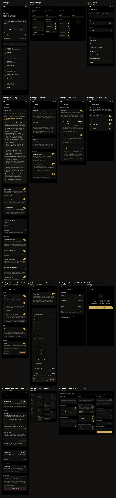

What each render shows

- **Settings** (`settings`)
- **Find settings** (`st-find`): The filter in use: matches for speed, history and marker, and the no-match line with Clear filter.
- **Appearance** (`appearance`)
- **Settings › Reading** (`st-reading`): Every Reading row: translation with the Restored Name note open, headings with Restored Names nested, the arrow and Scripture Browser layouts, reading aids and screen.
- **Settings › Listening** (`st-listening`): Bible Audio, Letter Voice, Default Speed and the three read-along switches, with Follow the Voice nested under Read-Along Highlight.
- **Settings › Auto-Scroll** (`st-autoscroll`): Drawn switched on so every control shows: Scroll Speed 4–40 lines/min, Auto-Continue and its pause, each with Reset.
- **Settings › Top-Nav Buttons** (`st-navbar`): Which optional icons sit in the reading bar, each row showing the icon it controls.
- **Settings › Search, Tabs & History** (`st-search-tabs-history`): Search with its two dependent rows, Tabs, History, and Clear History.
- **Settings › Mark as Read** (`st-mark-as-read`): Reading progress by book, with Clear per section and Clear All. Totals are real; read counts are placeholders.
- **Settings › A Return to The Garden** (`st-garden`): The four Image Quality tiers inline, Standard selected.
- **Settings › Help** (`st-help`): Show me around: a tour of eleven stops, about three minutes.
- **Settings › Your Data, lower half** (`st-about-data`): Below Export and Import: Verify, Storage with growth, Protect now, App version, Platform, Diagnostic Log and the Danger zone.
- **Settings choice sheets** (`st-pickers`): Every select sheet, including all 26 reading fonts each set in its own face, plus the amber clear-progress and clear-history confirms.
- **Settings: rows that come and go** (`st-states`): Dependent rows hidden when their switch is off, Mark as Read off, the progress table loading, and empty history.

### Your data & storage health · 10

Backup, verify, import and the banners that protect the reader's data.

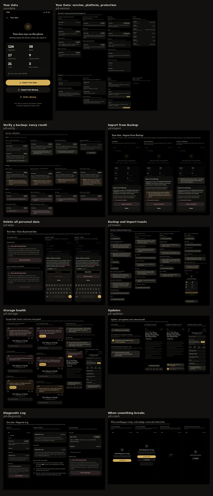

What each render shows

- **Your data** (`yourdata`)
- **Your Data: version, platform, protection** (`yd-version`): The App version row in all seven states, every Platform value, Protection in its six states, and the storage rows loading, unavailable and on day one.
- **Verify a backup: every result** (`yd-verify`): Three passes, Checking backup…, four warnings and six failures. The garbled ending is rewritten; the old wording is noted on the board.
- **Import from Backup** (`yd-import`): The overwrite confirm three ways: standard, low on space, and just after the cut-short warning.
- **Delete all personal data** (`yd-wipe`): The danger-zone card, paused while another backup runs, and the type-DELETE dialog empty and filled.
- **Backup and import toasts** (`yd-toasts`): All 27, grouped by flow with how long each stays, plus the save-dialog escape toast.
- **Storage health** (`yd-storage`): The six storage banners in priority order, the write toast and the restore guard, alone and in place.
- **Updates** (`yd-updates`): Just updated, Tap to continue listening, and the install-failure line.
- **Diagnostic Log** (`yd-diagnostic`): The row with four entries, with one, and absent in a clean session. It only describes itself; there is no list to open.
- **When something breaks** (`yd-crash`): The crash screen, the repeated crash with Reset to Home, the lazy Loading… state and Couldn’t load this section.

### Welcome, About, tour & hints · 6

First run, the eleven-stop tour and every quiet hint.

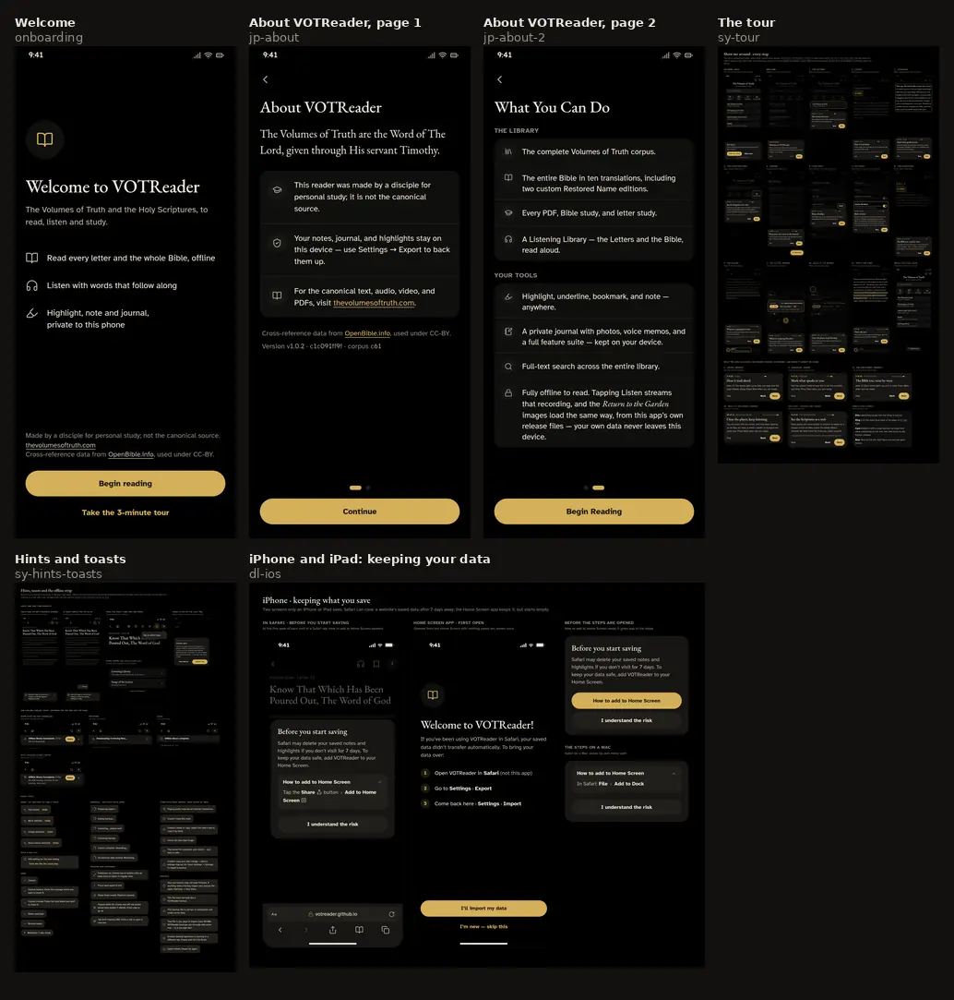

What each render shows

- **Welcome** (`onboarding`): One calm screen instead of four pop-ups.
- **About VOTReader, page 1** (`jp-about`): The personal-study disclaimer, thevolumesoftruth.com and the OpenBible.info CC-BY credit, with the version line moved in from Settings.
- **About VOTReader, page 2** (`jp-about-2`): What You Can Do: The Library and Your Tools, then Begin Reading.
- **The tour** (`sy-tour`): The prompt strip, the welcome and all eleven stops in the tour's own words, as calm coach marks with a ring and progress dots.
- **Hints and toasts** (`sy-hints-toasts`): The highlight hint, Copied, the tabs bubble, Hold to rearrange, the offline strip in four phases, and every toast grouped by kind.
- **iPhone and iPad: keeping your data** (`dl-ios`): The Safari 7-day warning with How to add to Home Screen open, and the Home Screen welcome card with its three steps.

### System states & errors · 3

Offline, missing content and crash states, written calm and helpful.

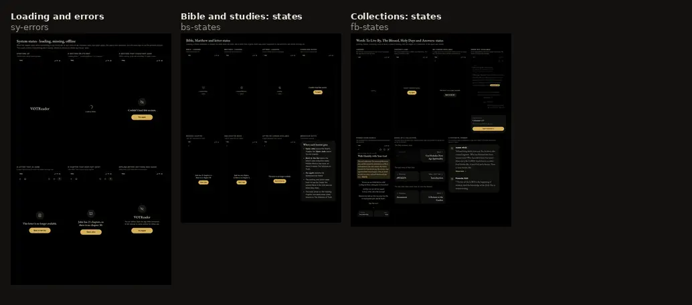

What each render shows

- **Loading and errors** (`sy-errors`): The splash, Loading Bible…, Couldn’t load this section, a letter that is gone, a missing chapter, and the offline page.
- **Bible and studies: states** (`bs-states`): Loading, Couldn’t load this section, a chapter that doesn't exist, a letter no longer available. These screens have no top bar in the app, so system Back is the only way out.
- **Collections: states** (`fb-states`): Loading, Couldn’t load this section, a letter no longer available, verse text missing, an entry opened from Search, the collection's ends, and an expanded footnote.

### Components, icons, app icon & widget · 3

The kit itself, and the app outside the app.

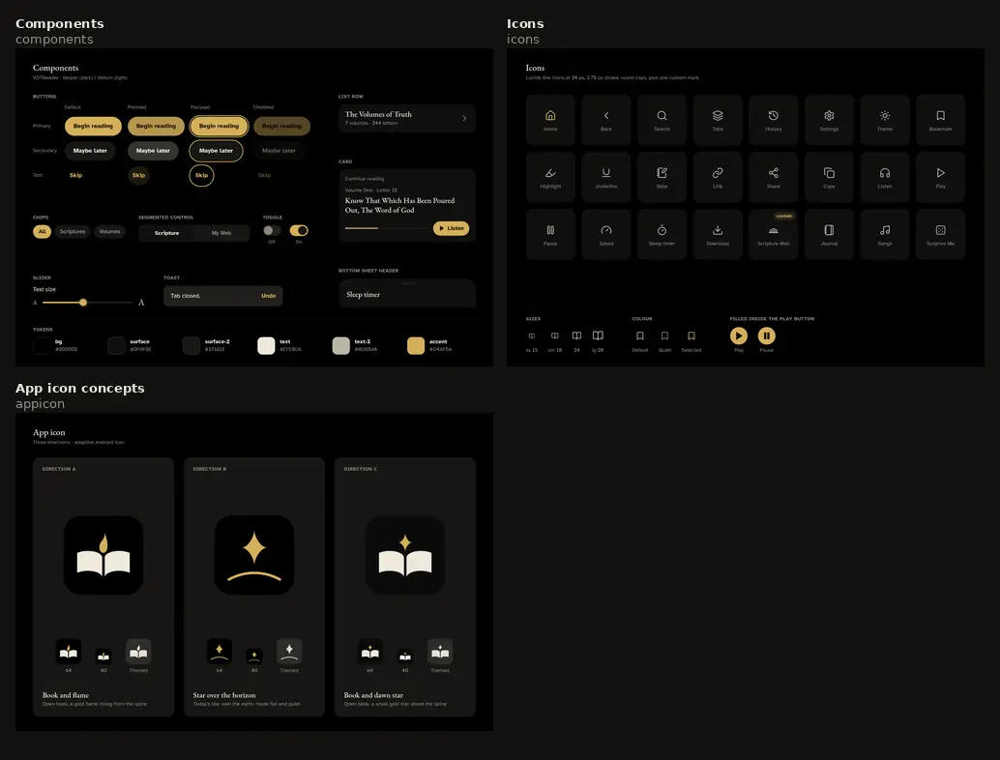

What each render shows

- **Components** (`components`)
- **Icons** (`icons`)
- **App icon concepts** (`appicon`)

### Concepts · 2

Ideas beyond what the app does today, drawn for discussion and labelled as concepts.

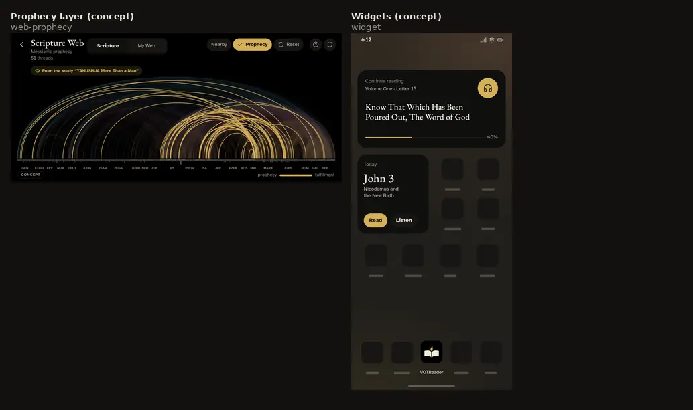

What each render shows

- **Prophecy layer (concept)** (`web-prophecy`): A concept only: the 51 messianic prophecy pairs already ship in the app's Scripture Web data but are never drawn.
- **Widgets (concept)** (`widget`): A concept only: the app has no home-screen widget and no daily reading.

